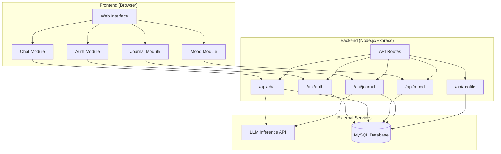
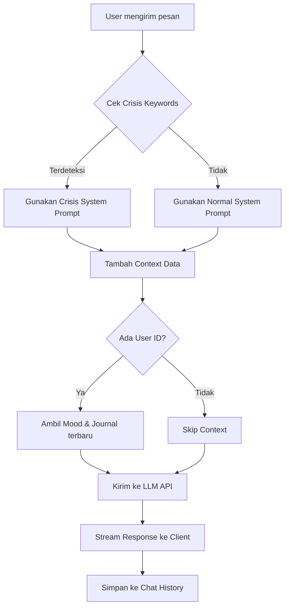

# Pulih

**Pulih** adalah chatbot kesehatan mental berbasis AI yang dirancang untuk memberikan dukungan emosional kepada pengguna. Aplikasi ini menggunakan pendekatan percakapan yang hangat dan empatik, bukan sebagai pengganti terapi profesional, tetapi sebagai teman yang hadir untuk mendengarkan.

## Preview


## Fitur Utama

- **AI Chat** - Percakapan dengan AI counselor yang responsif dan empatik
- **Crisis Detection** - Deteksi otomatis kata kunci krisis dengan respons khusus
- **Mood Tracking** - Pelacakan mood harian untuk memantau kesejahteraan emosional
- **Journaling** - Fitur catatan harian dengan insight dari AI
- **Chat History** - Riwayat percakapan tersimpan untuk kontinuitas sesi
- **Anonymous Mode** - Opsi penggunaan anonim untuk privasi pengguna

## Arsitektur Aplikasi


```mermaid
flowchart TB
    subgraph Client["Frontend (Browser)"]
        UI[Web Interface]
        Auth[Auth Module]
        Chat[Chat Module]
        Mood[Mood Module]
        Journal[Journal Module]
    end

    subgraph Server["Backend (Node.js/Express)"]
        API[API Routes]
        AuthRoute["/api/auth"]
        ChatRoute["/api/chat"]
        MoodRoute["/api/mood"]
        JournalRoute["/api/journal"]
        ProfileRoute["/api/profile"]
    end

    subgraph Services["External Services"]
        LLM[LLM Inference API]
        DB[(MySQL Database)]
    end

    UI --> Auth
    UI --> Chat
    UI --> Mood
    UI --> Journal

    Auth --> AuthRoute
    Chat --> ChatRoute
    Mood --> MoodRoute
    Journal --> JournalRoute

    API --> AuthRoute
    API --> ChatRoute
    API --> MoodRoute
    API --> JournalRoute
    API --> ProfileRoute

    ChatRoute --> LLM
    JournalRoute --> LLM
    AuthRoute --> DB
    ChatRoute --> DB
    MoodRoute --> DB
    JournalRoute --> DB
    ProfileRoute --> DB
```

## Alur Chat dengan Crisis Detection


```mermaid
flowchart TD
    A[User mengirim pesan] --> B{Cek Crisis Keywords}
    B -->|Terdeteksi| C[Gunakan Crisis System Prompt]
    B -->|Tidak| D[Gunakan Normal System Prompt]
    
    C --> E[Tambah Context Data]
    D --> E
    
    E --> F{Ada User ID?}
    F -->|Ya| G[Ambil Mood & Journal terbaru]
    F -->|Tidak| H[Skip Context]
    
    G --> I[Kirim ke LLM API]
    H --> I
    
    I --> J[Stream Response ke Client]
    J --> K[Simpan ke Chat History]
```

## Tech Stack

| Layer | Teknologi |
|-------|-----------|
| Frontend | HTML, CSS, JavaScript |
| Backend | Node.js, Express.js |
| Database | MySQL |
| AI/LLM | OpenAI-compatible API |
| Styling | TailwindCSS |

## Struktur Direktori

```
pisikologchatbot/
├── server.js              # Entry point aplikasi
├── server/
│   ├── routes/
│   │   ├── auth.js        # Autentikasi & registrasi
│   │   ├── chat.js        # Chat completion & history
│   │   ├── mood.js        # Mood tracking
│   │   ├── journal.js     # Journaling
│   │   └── profile.js     # User profile
│   └── utils/
│       ├── db.js          # Database operations
│       └── systemPrompt.js # AI system prompts
├── public/
│   ├── index.html         # Landing & auth page
│   ├── chat.html          # Chat interface
│   ├── profile.html       # User profile
│   ├── css/               # Stylesheets
│   └── js/                # Frontend modules
└── package.json
```

## Instalasi

### Prerequisites

- Node.js 18+
- MySQL Database
- API Key untuk LLM Inference

### Setup

1. Clone repository
   ```bash
   git clone https://github.com/ilhambintang17/pulih.git
   cd pulih
   ```

2. Install dependencies
   ```bash
   npm install
   ```

3. Konfigurasi environment variables
   ```bash
   cp .env.example .env
   ```
   
   Isi file `.env` dengan konfigurasi:
   ```env
   PORT=3000
   DB_HOST=localhost
   DB_USER=your_db_user
   DB_PASSWORD=your_db_password
   DB_NAME=pulih
   INFERENCE_URL=https://your-llm-api.com
   INFERENCE_KEY=your_api_key
   INFERENCE_MODEL_ID=your_model_id
   ```

4. Jalankan aplikasi
   ```bash
   node server.js
   ```

5. Akses aplikasi di `http://localhost:3000`

## Deployment

### Docker

```bash
docker build -t pulih .
docker run -p 3000:3000 --env-file .env pulih
```

### Heroku

Aplikasi sudah dikonfigurasi dengan `heroku.yml` untuk deployment via Docker.

## API Endpoints

| Method | Endpoint | Deskripsi |
|--------|----------|-----------|
| POST | `/api/auth/register` | Registrasi user baru |
| POST | `/api/auth/login` | Login user |
| POST | `/api/auth/anonymous` | Buat sesi anonim |
| GET | `/api/chat/history` | Ambil riwayat chat |
| POST | `/api/chat` | Kirim pesan chat (streaming) |
| POST | `/api/chat/session` | Simpan sesi chat |
| POST | `/api/chat/summary` | Generate ringkasan sesi |
| POST | `/api/chat/suggest` | Generate saran respons |
| POST | `/api/mood` | Simpan data mood |
| GET | `/api/mood` | Ambil data mood |
| POST | `/api/journal` | Simpan journal entry |
| GET | `/api/journal` | Ambil journal entries |

## Lisensi

ISC

## Disclaimer

Pulih adalah aplikasi pendukung kesehatan mental dan **bukan pengganti** konsultasi dengan psikolog atau psikiater berlisensi. Jika Anda mengalami krisis kesehatan mental, hubungi layanan darurat atau hotline kesehatan mental:

- **Into The Light Indonesia**: 119 ext. 8
- **Yayasan Pulih**: (021) 788-42580
